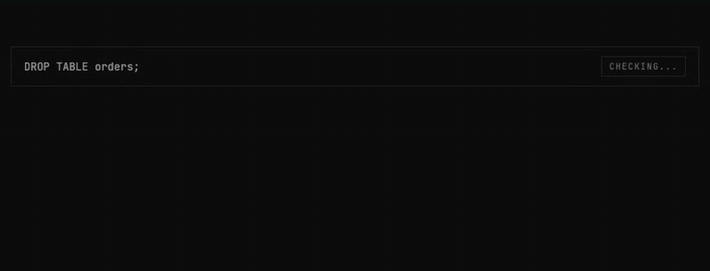
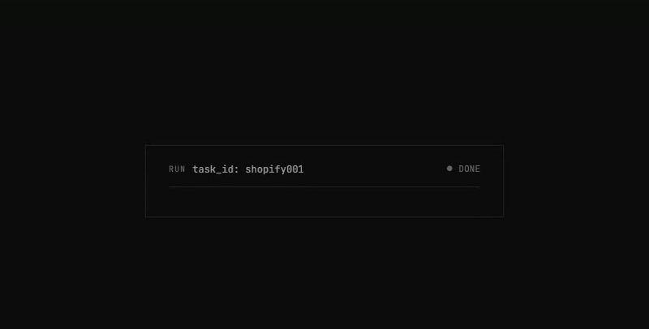

<div align="center">

# ⚡ SignalPilot Data Agent

### 🏆 Officially ranked #1 on [Spider 2.0-DBT](https://spider2-sql.github.io/) — **51.56**

**+7.45 points above the next best agent (Databao by JetBrains, 44.11). New SOTA on the 68-task dbt benchmark as of Apr 21, 2026.**

**Governed AI agents with connector suites and access to your data stack (db, dbt and more), optimized by [AutoFyn](https://github.com/SignalPilot-Labs/AutoFyn).**

[](https://github.com/SignalPilot-Labs/signalpilot/stargazers)

[🚀 Try SignalPilot](#try-signalpilot-data-agent) · [⭐ Star the repo](https://github.com/SignalPilot-Labs/signalpilot/stargazers) · [📊 See benchmarks](benchmark/) · [🌐 signalpilot.ai](https://www.signalpilot.ai/) · [⚙️ Try AutoFyn](https://github.com/SignalPilot-Labs/AutoFyn) · [📅 Book an intro](https://cal.com/fahimaziz/autofyn-intro)

</div>

---

## For Agentic Data and Platform Teams

We partner with data, analytics, and platform teams who want to put AI agents to work on real warehouse workloads — safely.

- **Governed production access** — bring SignalPilot into your Snowflake / BigQuery / Postgres / dbt stack with enterprise guardrails.
- **Harness & agent optimization with AutoFyn** — we tune your agent harness, prompts, skills, and retrieval to hit production accuracy targets on *your* data, not a leaderboard.
- **Benchmark-driven evaluation** — we bring the same eval rigor that earned us the official #1 spot on Spider 2.0-DBT (51.56, +7.45 over the runner-up) into your environment: custom task suites, regression tracking, and measurable lift.
- **Enterprise support** — SSO, private deployments, SLAs, and hands-on engineering support.

**Talk to us** about your data, dbt, or agent harness optimization workload: [cal.com/fahimaziz/autofyn-intro](https://cal.com/fahimaziz/autofyn-intro) · Learn more at [signalpilot.ai](https://www.signalpilot.ai/).

---

**Index** — [How It Works](#how-it-works) · [Try SignalPilot](#try-signalpilot-data-agent) · [Architecture](#architecture) · [MCP Tools](#mcp-tools) · [Use With Claude Code](#use-with-claude-code-plugin) · [Use With Any MCP Client](#use-with-any-mcp-client) · [Connect a Database](#connect-a-database) · [Project Structure](#project-structure) · [Community](#community)

---

## How It Works

Five stages run on every task. The agent never writes SQL ad-hoc against your warehouse — it plans, scans, governs, builds, and reports through the SignalPilot gateway.

### 01 — Describe what you need


- Plain-English goal in chat (e.g. *"Build `shopify__daily_shop` — orders, abandoned checkouts, fulfillment counts by day"*)
- Parsed into a structured task — no SQL written, no warehouse touched yet

### 02 — Agent scans your project


- Inspects dbt project + warehouse: sources, staging, marts, missing models
- Flags date hazards (`current_date`, `now()`)
- Resolves build order across the DAG — deterministic, not a guess

### 03 — Every query is governed



- DDL (`DROP`, `CREATE`, `ALTER`) and DML (`INSERT`, `UPDATE`, `DELETE`) blocked at the parser
- Auto-`LIMIT` injection on unbounded `SELECT`
- Per-session budget cap kills queries that would scan over your $ threshold
- Every query audited: timestamp, agent ID, policy reason, full SQL

### 04 — DAG builds itself


- `dbt parse` runs first to catch structural errors
- Models materialized in topological order
- Verifier agent reads dbt errors and proposes fixes (renames, missing CTEs, fan-out, date-spine guards)
- Tests run after build and feed back into the loop

### 05 — Full audit receipt



- Structured summary: duration · agent turns · governed queries · queries blocked · models built · columns validated
- Every line traces back to a specific MCP tool call
- One artifact for compliance, debugging, and cost review

---

## Try SignalPilot Data Agent

**Give your AI agent governed, production-ready access to your data stack** — db, dbt, and more. Schema discovery, read-only SQL, dbt project management, all through a single MCP server. No hallucinated tables. No dropped rows. No unbounded queries.

```bash
# Start SignalPilot
git clone https://github.com/SignalPilot-Labs/signalpilot.git
cd signalpilot
docker compose up -d
# Web UI available at http://localhost:3200

# Add to Claude Code
/plugin marketplace add ./plugin
/plugin install signalpilot-dbt@signalpilot
```

That's it. Claude Code now has governed access to your databases.

---

## Architecture

Other MCP-DB servers don't enforce LIMIT injection, DDL blocking, or audit logging by default. SignalPilot does — that's why agents on it set the SOTA on Spider 2.0-DBT.

```
┌─────────────────────────────────────────────────────────────┐
│  Your AI Agent (Claude Code, Agent SDK, any MCP client)     │
└────────────────────────────┬────────────────────────────────┘
                             │ MCP Protocol
┌────────────────────────────▼────────────────────────────────┐
│  SignalPilot Gateway                                         │
│  ┌────────────┐ ┌──────────────┐ ┌───────────────────────┐ │
│  │ Governance │ │ Schema       │ │ dbt Project           │ │
│  │ • LIMIT    │ │ • DDL        │ │ • Map / Validate      │ │
│  │ • DDL block│ │ • Explore    │ │ • Model verification  │ │
│  │ • Audit    │ │ • Join paths │ │ • Date boundaries     │ │
│  └────────────┘ └──────────────┘ └───────────────────────┘ │
└────────────────────────────┬────────────────────────────────┘
                             │
        ┌────────────────────┼────────────────────┐
        ▼                    ▼                    ▼
   ┌─────────┐        ┌──────────┐        ┌──────────┐
   │ DuckDB  │        │ Postgres │        │Snowflake │
   └─────────┘        └──────────┘        └──────────┘
```

**Governance** — Every query is read-only, LIMIT-injected, DDL/DML-blocked, and audit-logged. Your AI agent cannot drop tables, modify data, or run unbounded queries.

**Schema Discovery** — 10+ tools for exploring databases without writing SQL: table lists, column types, sample data, join path discovery, value distributions.

**dbt Intelligence** — Project mapping, parse validation, model schema checking, fan-out detection, cardinality auditing, date boundary analysis.

---

## Use With Claude Code (Plugin)

The [`plugin/`](plugin/) directory is a Claude Code plugin that adds all SignalPilot tools + battle-tested dbt skills to your normal Claude Code session.

```bash
# Add the marketplace and install
/plugin marketplace add ./plugin
/plugin install signalpilot-dbt@signalpilot
/reload-plugins
```

Then add a `.mcp.json` to your project root to connect the MCP server:

```json
{
  "mcpServers": {
    "signalpilot": {
      "type": "http",
      "url": "http://localhost:3300/mcp"
    }
  }
}
```

See [`plugin/README.md`](plugin/README.md) for full details on included skills and agents.

---

## Use With Any MCP Client

SignalPilot exposes a standard MCP server via streamable-http transport.

### Claude Code / Claude Desktop

Add to `.mcp.json` in your project root:

```json
{
  "mcpServers": {
    "signalpilot": {
      "type": "http",
      "url": "http://localhost:3300/mcp",
      "headers": {
        "X-API-Key": "sp_your_api_key_here"
      }
    }
  }
}
```

### Cursor

Add to `.cursor/mcp.json`:

```json
{
  "mcpServers": {
    "signalpilot": {
      "url": "http://localhost:3300/mcp",
      "headers": {
        "X-API-Key": "sp_your_api_key_here"
      }
    }
  }
}
```

### Generic HTTP (Any MCP Client)

```json
{
  "url": "http://localhost:3300/mcp",
  "transport": "streamable-http",
  "headers": {
    "X-API-Key": "sp_your_api_key_here"
  }
}
```

Replace `sp_your_api_key_here` with your API key from **Settings → API Keys** in the web UI. In local mode without an API key configured, the `headers` field can be omitted.

---

## Connect a Database

Via the web UI at `http://localhost:3200`, or via API:

```bash
curl -X POST http://localhost:3300/api/connections \
  -H "Content-Type: application/json" \
  -d '{
    "name": "my-warehouse",
    "db_type": "duckdb",
    "database": "/path/to/warehouse.duckdb"
  }'
```

Supported: DuckDB, PostgreSQL, SQLite, Snowflake, BigQuery.

---

## MCP Tools

40 governed tools across data exploration, query intelligence, dbt project intelligence, model verification, compute, and project management.

See [`docs/TOOLS.md`](docs/TOOLS.md) for the full reference.

---

## Project Structure

```
SignalPilot/
├── signalpilot/
│   ├── gateway/              # FastAPI backend — MCP server, REST API, governance
│   │   └── gateway/
│   │       ├── api/          # 13 API modules, 100+ REST endpoints
│   │       ├── connectors/   # 11 database connectors + pooling + SSH tunneling
│   │       ├── governance/   # Budget, cache, PII redaction, annotations
│   │       ├── dbt/          # Project scanning, validation, hazard fixing
│   │       ├── db/           # SQLAlchemy ORM models + async engine
│   │       ├── mcp_server.py # 39 MCP tool definitions
│   │       ├── store.py      # Encrypted credential storage (Fernet/PBKDF2)
│   │       └── auth.py       # Clerk JWT (cloud) / local auth
│   └── web/                  # Next.js 16 frontend — 20 pages, Tailwind CSS
│       ├── app/              # App router pages (dashboard, connections, query, etc.)
│       ├── components/       # 20 UI components (sidebar, command palette, etc.)
│       └── lib/              # API client, auth context, hooks
├── plugin/                   # Claude Code plugin (10 skills, 1 verifier agent)
│   ├── agents/               # Verifier agent (7-check post-build protocol)
│   └── skills/               # dbt-workflow, sql-workflow, db-specific SQL, etc.
├── sp-sandbox/               # gVisor sandboxed Python execution
├── benchmark/                # Spider 2.0-DBT benchmark suite (SOTA: 51.56%)
└── docker-compose.yml        # Full stack: web, gateway, postgres, sandbox
```

---

## Community

- 🐛 [Open an issue](https://github.com/SignalPilot-Labs/signalpilot/issues) — bugs, feature requests, connector requests
- 💬 [GitHub Discussions](https://github.com/SignalPilot-Labs/signalpilot/discussions) — questions, ideas, show-and-tell
- 🔒 [Security policy](SECURITY.md) — report vulnerabilities responsibly

### Contributors

[](https://github.com/SignalPilot-Labs/signalpilot/graphs/contributors)

---

## Star History

If SignalPilot is useful, please ⭐ — it helps a ton.

[](https://star-history.com/#SignalPilot-Labs/signalpilot&Date)

---

## License

Apache 2.0 — see [LICENSE](LICENSE).
