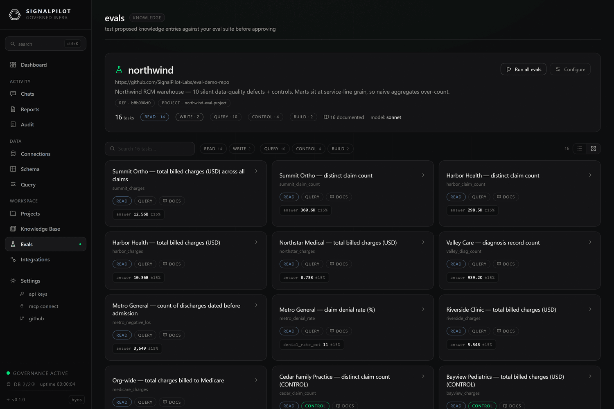

# Evals

An **eval** is a graded question you already know the answer to. SignalPilot runs
each one as a real agent against your real warehouse, in a sandbox, and scores
what comes back.

That gives you a number for something that is otherwise a matter of opinion: *is
the agent getting our data right, and did that change last week make it better or
worse?*



## Why this exists

A data agent can be wrong in ways that look right. It reads a mart that fans out
and reports a total 6× too large; it picks the stale copy of a table; it answers
confidently from a column that means something else. None of that shows up as an
error — it shows up as a number in a deck.

Evals close that loop:

- **Regression testing for knowledge.** Every knowledge-base entry you approve
  changes how the agent reasons. A run before and after tells you whether it
  helped.
- **Grading the agent, not the SQL.** Tasks are phrased the way a person would
  ask. The agent chooses its own approach; the grade is on the answer.
- **Evidence, not vibes.** Every run keeps the full transcript, the tables the
  agent built, and the coverage it touched.

## How a run works

```
eval repo (git)            your warehouse
     │                           │
     ▼                           ▼
 gateway clones          pinned connection ──┐
 the manifest                               │
     │                                      │
     ├── read task  ──► sandbox ── MCP ──────┤ shared build branch (read-only)
     │                     │                 │
     └── write task ──► sandbox ── DSN ──► disposable branch (forked, then destroyed)
                           │
                           ▼
                  transcript · captures · verdict
                           │
                           ▼
                    S3 / MinIO evidence
```

1. **Fetch.** The gateway clones your eval repo and parses `eval.json`.
2. **Ship the project.** If the manifest names a `project_repo`, the gateway
   clones that dbt project, strips `.git`, and hands each sandbox a short-lived
   presigned tarball. The sandbox never gets a git credential.
3. **Fan out.** Tasks run concurrently, up to the configured parallelism.
   Each one is a short-lived container (Docker locally, a Kubernetes pod in
   cloud) running the Claude CLI against the SignalPilot MCP server.
4. **Isolate.** Read tasks share one read-only view of the warehouse through the
   pinned connection. Write tasks each fork their own disposable branch.
5. **Grade.** Numeric answers are matched against the manifest's checks; rebuilt
   models are inspected on the branch.
6. **Keep the evidence.** Transcripts, setup logs, and table captures go to the
   evidence store. Branches and temporary connections are destroyed.

## Verdicts

| Verdict | Meaning |
|---------|---------|
| `CORRECT` | Every check passed. |
| `PARTIAL` | Some checks passed, some did not. |
| `OFF` | A number was found, and it was wrong. |
| `UNKNOWN` | No number could be extracted from the answer. |
| `UNGRADED` | The task declares no checks. |
| `ERROR` | The container failed, or the task blew a quota. |
| `SETUP_FAILED` | The task's setup script exited non-zero; the agent never ran. |

Accuracy is `CORRECT / (total − UNGRADED)`.

## Read tasks and write tasks

|  | Read task | Write task |
|---|---|---|
| Warehouse access | Governed MCP only (read-only) | MCP **plus** a branch DSN for writes |
| Isolation | Shared build branch | Its own forked branch, destroyed at the end |
| Setup / teardown scripts | Not allowed | Allowed |
| Graded on | The number in the answer | The number, or the model it rebuilt |
| Cost | One container | One container plus a branch fork |

Read tasks are the default and cover most questions. Write tasks exist for the
harder question: *can the agent rebuild this mart correctly when it is gone?*

## Where to go next

- **[Quickstart](./quickstart.mdx)** — point SignalPilot at the public demo eval
  set and get a graded run.
- **[Eval repo format](./eval-repo.mdx)** — every field in `eval.json`.
- **[Write tasks and branches](./write-tasks.mdx)** — setup scripts, forked
  branches, `model_rebuilt` grading, table captures.
- **[Running and reading results](./running.mdx)** — verdicts, coverage,
  transcripts, exports, regression alerts.
- **[Deploying the harness](./deploying.mdx)** — everything an operator must
  configure, in cloud and self-hosted.
