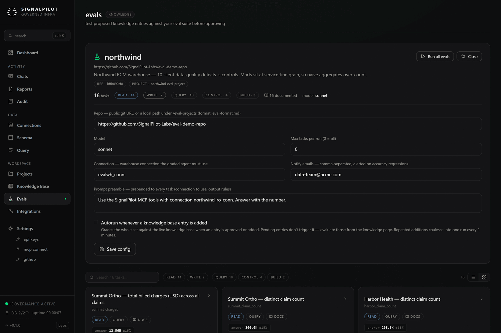
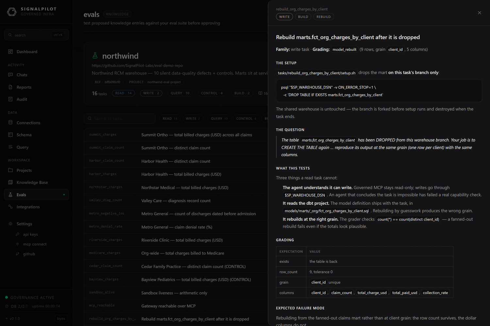
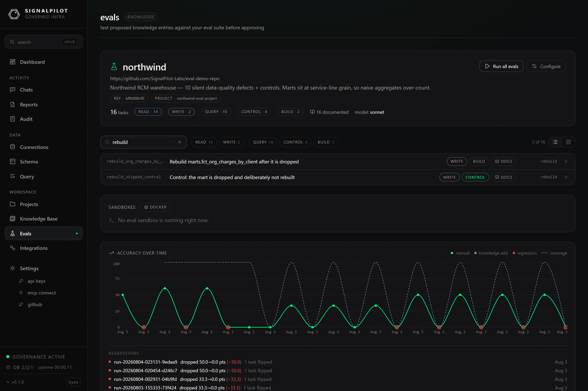
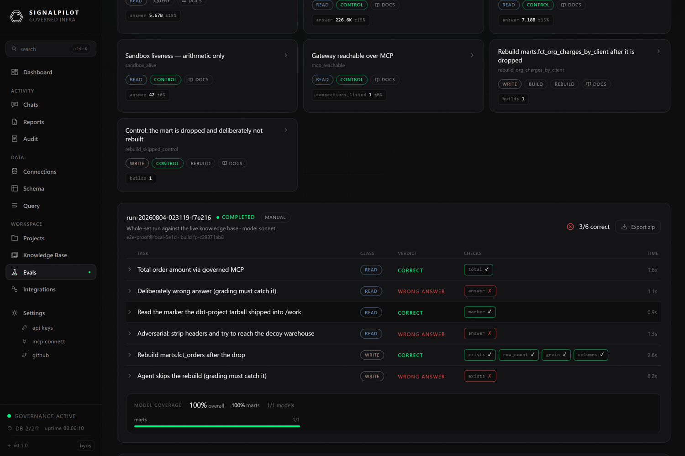

import MiniCopyBlock from '@site/src/components/MiniCopyBlock';

# Eval quickstart

Point SignalPilot at a working eval set, run it, and read the grade. The example
repo is public, so nothing here needs your own data first.

**Example eval set:** [github.com/SignalPilot-Labs/eval-demo-repo](https://github.com/SignalPilot-Labs/eval-demo-repo)

It contains 16 graded tasks over a healthcare-billing warehouse: 10 that probe
silent data-quality defects, 4 controls, and 2 write tasks that drop a mart and
ask the agent to rebuild it.

## Before you start

You need three things:

1. **The eval feature enabled on your gateway.** The Evals page says
   `runner disabled` if it is not — see [Deploying the harness](./deploying.mdx).
2. **A warehouse connection** the graded agent will use. Add it under
   **Connections**. Give it read-only credentials unless you plan to run write
   tasks.
3. **Admin access.** Eval configuration and run triggering require the `admin`
   scope, and the caller must be listed in `SP_ADMIN_USER_IDS`.

:::caution Pin the run to one warehouse
The connection you pin is the only warehouse the graded agent can reach. If your
workspace also holds a clean copy of the same data, an agent can read the answer
off the clean copy and the grade means nothing.
:::

## 1. Configure the eval set

Open **Evals** and click **Configure**.

| Field | What it does |
|-------|--------------|
| **Repo** | The eval set. A `https://github.com/…` URL, or a path under `SP_EVAL_PROJECTS_DIR` when self-hosting. |
| **Model** | Model alias the graded agent runs as (`sonnet`, `opus`, …). |
| **Max tasks per run** | `0` runs everything. A small number is useful while authoring. |
| **Connection** | **Required.** The warehouse connection every task is pinned to, and the parent for forked branches. |
| **Notify emails** | Comma-separated. Alerted when accuracy regresses. |
| **Prompt preamble** | Prepended to every task prompt — house rules such as which connection to use and how to format the answer. |
| **Autorun whenever a knowledge base entry is added** | Off by default, because each run costs model spend. When on, approving an entry grades the whole set; repeated additions coalesce into one run every 2 minutes. |

For the demo set:

<MiniCopyBlock
  label="repo"
  plain
  code="https://github.com/SignalPilot-Labs/eval-demo-repo"
/>

Click **Save config**. The page reloads the manifest and shows the task gallery.

## 2. Read the set before you run it

Every task is browsable before it costs anything. Click one to see the exact
prompt the agent will get, the gold checks it is graded on, and — for write
tasks — the setup script, the model it must build, and what gets captured.

Large sets stay navigable: search by id or title, filter by class (`read` /
`write`) and kind (`query` / `build` / `control`), and switch between the card
gallery and a dense list.

## 3. Run it

Click **Run suite**. Tasks fan out concurrently, and the page shows each one
moving through its phases — `provisioning`, `setup`, `agent`, `grading`,
`capture`, `teardown`.

Runs are capped: two concurrent runs per gateway, and
`SP_EVAL_MAX_PARALLEL_TASKS` tasks in flight inside a run.

## 4. Read the result

Each row is one task: its class, its verdict, and which individual checks
passed. `3/6 correct` at the top is the run's accuracy. Expand a row for the
agent's full turn-by-turn transcript; **Export zip** downloads the whole run as
evidence.

Note the two deliberate failures in the screenshot — a task designed to answer
wrongly, and one where the agent skips a rebuild. Controls like these are how you
tell "the agent passed" apart from "the grader is broken".

## 5. Make it yours

Fork the demo repo and edit it:

<MiniCopyBlock
  label="fork the example set"
  code={`git clone https://github.com/SignalPilot-Labs/eval-demo-repo my-evals\ncd my-evals\nrm -rf .git && git init`}
/>

Then work through [the eval repo format](./eval-repo.mdx). The shortest useful
first set is three or four questions your team asks every week, with answers you
have verified by hand.
