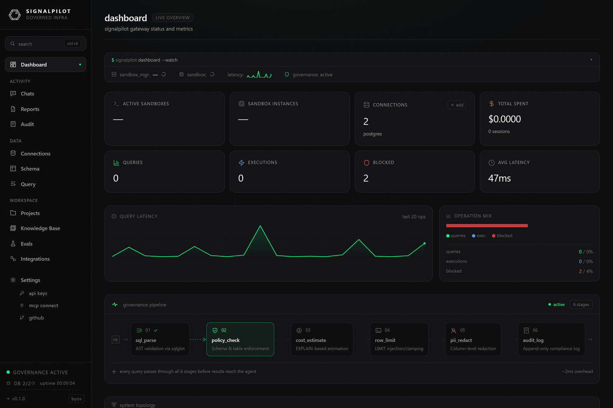

# Dashboard, chats, reports and health

Four smaller surfaces that answer "what is happening right now" and "what
happened earlier".

## Dashboard

The landing page after sign-in. A live overview of the workspace: connections
configured and their health (`healthy` / `degraded`), average query latency,
execution counts, and active sandboxes, with links into each.

Treat it as the daily check: a connection that flipped to `degraded`, or a
latency figure that doubled, is visible here before anyone files a ticket.

The **governance pipeline** strip at the bottom is worth a look on day one: it
shows the six stages every query passes through — `sql_parse`, `policy_check`,
`cost_estimate`, `row_limit`, `pii_redact`, `audit_log` — and the overhead they
add.

## Chats

Every agent conversation that ran against this workspace, kept as a thread you
can reopen. A thread shows the turn-by-turn exchange, the tool calls the agent
made, and the per-message cost.

This is the record for "why did the agent do that?" — the tool calls are listed
in order, so you can see which tables it read and which knowledge entries it
retrieved before answering. Threads that are still running show a live
`thinking` state.

## Reports

Rendered HTML reports produced by agents through the `manage_report` tool, with
search across them. A report is a durable artifact — it survives the session that
made it — which makes it the right destination for a recurring analysis.

Reports are capped at 5 MB of HTML each. Agents can also publish to Notion
instead; see [Notion](/docs/connect-notion).

## Connection health

Per-connection latency percentiles (p50 / p95 / p99), error rates, failure
counts, and cache statistics, refreshed by a background monitor that opens a real
connection to every connection in every workspace every 30 seconds.

Status is one of `healthy`, `degraded`, or `error`. **Test** runs an immediate
check against one connection rather than waiting for the next sweep.

Health events are retained for 7 days. The agent-side equivalent is the
`connection_health` MCP tool, which returns the same figures.

## Sandboxes

The gVisor-isolated Python execution environments — one row per sandbox with its
state (`starting`, `running`, `stopped`), and a detail view per sandbox.

Sandboxes are what notebook and eval workloads execute inside. On the eval side
the same panel streams container logs and surfaces `oom_killed` and scheduling
events; see [Running evals](/docs/evals/running).
