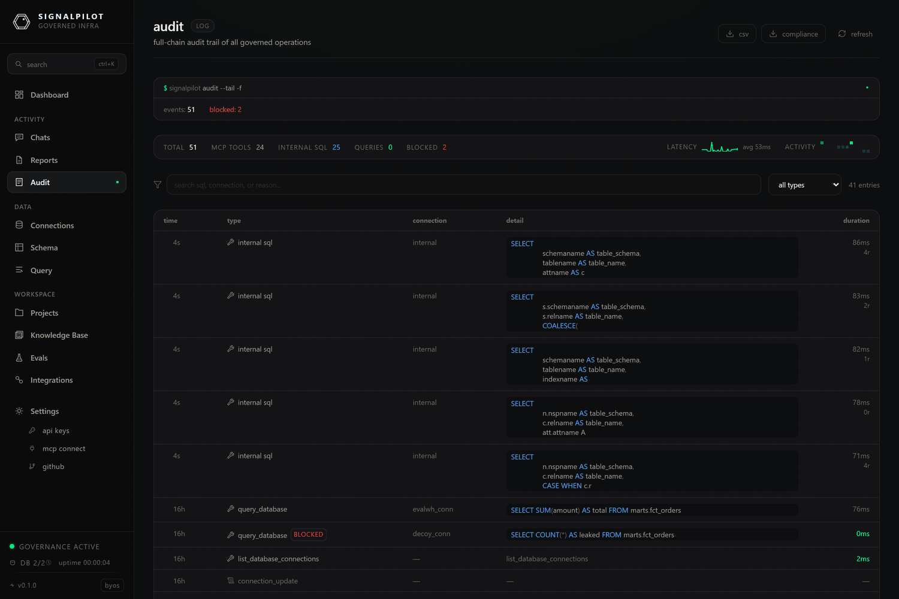

# Audit log

Every statement that reaches a warehouse through SignalPilot is recorded —
including the ones that were refused. The **Audit** page is that record, and
`GET /api/audit/export` is the same record as a file.

Auditing is always on. There is no environment variable that disables it.

## What a record contains

| Field | Notes |
|-------|-------|
| `timestamp`, `org_id`, `user_id` | Who and when. |
| `event_type` | `mcp_tool`, `mcp_sql`, `execute`, and internal variants. |
| `connection_name` | Which warehouse. |
| `sql_text` | The statement, **with string literals replaced by `<REDACTED>`**. |
| `tables` | Tables the statement touched. |
| `rows_returned`, `duration_ms`, `cost_usd` | Result shape, latency, estimated cost. |
| `blocked`, `block_reason` | Set when governance refused the statement. |
| `agent_id`, `sandbox_id`, `parent_id` | Attribution: which agent, which sandbox, which parent call. |
| `client_ip` | Origin of the request. |

Literal redaction is unconditional, which means the audit log is safe to export
to a compliance system without carrying customer values with it. It also means
the log tells you *shape*, not values: `WHERE email = <REDACTED>` records that
someone filtered on an email, not whose.

## Reading the page

Filter by connection, by event type, and by whether the statement was blocked.
Expanding a row shows the full statement, the tables it touched, the timing, and
the block reason where there is one.

The two questions this page answers well:

- **"What did the agent actually run?"** — filter to `mcp_sql` for a session and
  read the sequence. It is the ground truth behind a transcript.
- **"What are we refusing?"** — filter to blocked entries. A steady stream of
  blocks usually means an agent is being pointed at something it should have
  been given a proper path to, not that governance is misconfigured.

## Export

**Export** downloads the filtered trail as JSON or CSV — intended for SOC 2,
HIPAA, or EU AI Act evidence. It requires the `admin` scope.

Exports are capped at `SP_MAX_EXPORT_ROWS` (50,000 by default). A truncated
export says so in the `X-Truncated` and `X-Max-Rows` response headers rather than
silently returning a partial file — check them if you are automating this.

On Cloud, audit export is a Team and Enterprise feature, and audit retention
varies by plan (7 days on Free, 90 on Pro, 365 on Team and Enterprise).

:::caution Self-hosted retention is your job
A self-hosted gateway never prunes `gateway_audit_logs`. The table grows without
bound. Add a periodic delete matching your retention policy — see
[Operations](/docs/setup/operations#retention-and-growth).
:::

## Related

- **[Governance](/docs/reference/governance)** — what gets blocked, and why.
- **[Security](/docs/security)** — the wider control set.
- **[Chats](/docs/product/activity#chats)** — the conversational view of the same
  activity, with tool calls in order.
