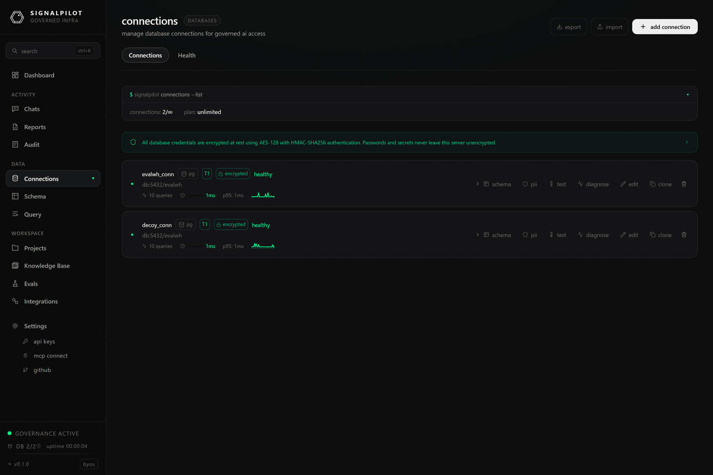

# Adding a connection

**Connections → Add Connection** is where a warehouse becomes something the agent
can use. This page covers the form itself; for per-engine specifics see the
[Databases](/docs/databases/overview) section, and for the API shape see
[Connect a database](/docs/connect-database).

## Quick-start presets

The form opens on a preset list rather than a blank connector picker, because
most connections are a known shape:

`PostgreSQL` · `AWS RDS PostgreSQL` · `GCP Cloud SQL (PG)` · `Xata Postgres` ·
`MySQL` · `AWS RDS MySQL` · `SQL Server` · `Azure SQL Database` · `Snowflake` ·
`Snowflake (Key Pair)` · `Google BigQuery` · `BigQuery (Service Account)` ·
`Amazon Redshift` · `Redshift Serverless` · `Databricks` · `Databricks (OAuth)` ·
`ClickHouse` · `ClickHouse Cloud` · `Trino` · `Starburst Galaxy (Trino)` ·
`DuckDB` (local file or in-memory) · `MotherDuck` · `SQLite` ·
`SSH Tunnel (any DB)`

Picking one pre-fills ports, SSL defaults, and the auth method that engine
normally uses. Everything stays editable.

## Fields and credentials

You can enter a connection two ways: **fields** (host, port, database, user,
password) or a **connection string**. Use whichever your credentials arrive in;
the stored result is the same, and credentials are encrypted at rest.

Engine-specific authentication:

| Engine | Methods |
|--------|---------|
| Snowflake | password, key pair (JWT), OAuth, MFA, programmatic access token, Okta |
| Trino / Starburst | none, basic, JWT, Kerberos, certificate |
| BigQuery | service-account JSON, application default credentials |
| Databricks | personal access token, OAuth |
| Redshift | password, AWS IAM |
| SQL Server | SQL auth, Azure AD / Entra ID |

## Network options

- **SSL** — `disable`, `allow`, `prefer`, `require`, `verify-ca`, `verify-full`,
  with optional CA / client certificate material. `verify-full` is the right
  choice for anything crossing a network you do not control.
- **SSH tunnel** — reach a warehouse that has no public listener by tunnelling
  through a bastion. See [SSH tunnelling](/docs/setup/ssh-tunneling) for the key
  handling and jump-host details.
- **IP allowlisting** — if your warehouse restricts inbound IPs, allow the
  gateway's egress addresses. The form shows which apply to your deployment.
- **Timeouts** — connection timeout (15 s default) and query timeout (120 s
  default), plus an optional keepalive interval for long-lived pools.

## Scope, schemas and refresh

- **Scope** — a *workspace* connection is shared across all projects. Scope it to
  a project when only that project should see it.
- **Schema filters** — comma-separated include and exclude lists. On a warehouse
  with hundreds of schemas this is the difference between a usable schema cache
  and an unusable one; it also bounds what the agent can discover.
- **Auto-refresh** — re-scan the schema on a schedule so `schema_diff` can report
  drift.

## Safety

Everything that reaches the warehouse through SignalPilot — the agent, the
[query console](/docs/product/query-console), a notebook — passes the same
governance layer: DDL and DML are rejected at parse time, `SELECT` gets a LIMIT
injected, dangerous functions are denied, and every statement is audit-logged
with its literals redacted.

That is the enforcement boundary, and it does not depend on how the connection
was configured. Still, give SignalPilot a read-only warehouse role wherever you
can: defence in depth costs nothing here, and it is the only thing that also
protects you from a mistake made outside the gateway.

Write access is deliberately narrow: it exists for eval write tasks, which run
against a disposable branch of the warehouse rather than the warehouse itself
(see [Write tasks](/docs/evals/write-tasks)).

## After it is created

- **Test** verifies the credentials immediately.
- The schema is scanned and cached, which is what the
  [schema explorer](/docs/product/schema-explorer) and the agent's discovery
  tools read.
- A background monitor tracks latency and error rates — see
  [connection health](/docs/product/activity#connection-health).
