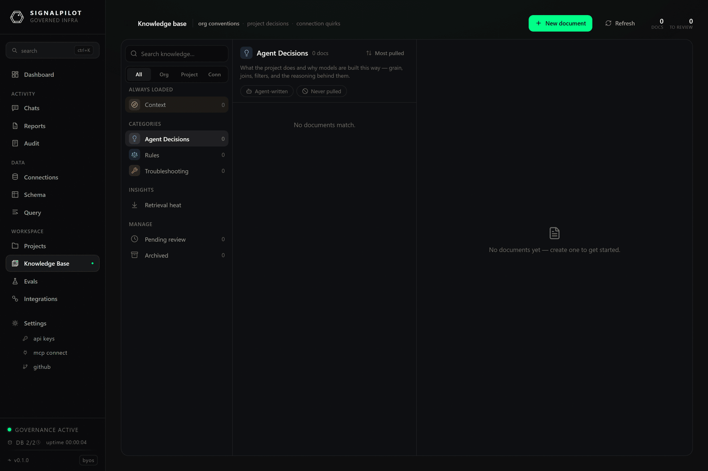

# Knowledge Base

The knowledge base is what stops your agent relearning your warehouse every
session. It holds the things that are true about *your* data and are not
discoverable from the schema: which mart is authoritative, why a join is a
`LEFT JOIN`, what "active customer" means here, which table lies about its grain.

Agents read from it through `get_knowledge`, `search_knowledge` and
`read_knowledge`, and write back to it through `propose_knowledge` — proposals
land as **pending** until a human approves them.

## Scopes and categories

Every entry has a **scope** (who it applies to) and a **category** (what kind of
thing it is). The two are constrained against each other: not every category is
valid at every scope.

| Scope | `scope_ref` | Valid categories |
|-------|-------------|------------------|
| `org` | — | Context, Agent Decisions, Rules |
| `project` | project id | Context, Agent Decisions, Rules, Troubleshooting |
| `connection` | connection name | Context, Troubleshooting |

| Category | What belongs here |
|----------|-------------------|
| **Context** | The always-loaded brief for this org, project or connection — the CLAUDE.md-equivalent. Every agent gets it on every task. |
| **Agent Decisions** | What the project does and why models are built the way they are: grain, joins, filters, and the reasoning behind them. |
| **Rules** | How to write models here, plus the business rules encoded in the data. |
| **Troubleshooting** | Known errors, fixes, and database-specific quirks the team has already hit. |

The distinction that matters most is **Context vs everything else**. Context is
loaded unconditionally, so it costs tokens on every single task — keep it short
and stable. The other three are retrieved on demand, so they can be numerous and
specific.

## Using the page

The left rail filters by scope (`All` / `Org` / `Project` / `Conn`) and by
category, with live counts. The middle column lists entries; sort cycles through
**views**, **recent**, **alphabetical**, and **least-viewed**. The right pane
renders the selected entry.

- **⌘E / Ctrl-E** starts editing the open entry. Unsaved edits prompt before you
  navigate away.
- **`[[wikilinks]]`** resolve to other entries by title or slug. The entry footer
  lists **backlinks** — every other entry that links to this one — which is the
  fastest way to find the cluster of notes around one model.
- **History** shows every prior version with its author and lets you revert. How
  many versions are kept depends on plan (5 on Free and Pro, 25 on Team, 50 on
  Enterprise).
- **Archive** is a soft delete: the entry stops being retrieved but stays
  readable under the archived filter.

### Pending proposals

When an agent calls `propose_knowledge`, the entry appears under **pending** with
a count badge. Review it as you would a pull request — the agent's proposals are
generated from what it inferred during a task, and an inference that was true
once is not automatically a rule.

Two buttons matter on a pending entry:

- **Approve** promotes it to active, and it starts being retrieved immediately.
- **Evaluate Change** runs your eval set with this entry overlaid on the live
  knowledge base, so you can see what it does to accuracy *before* approving it.
  See [Evals](/docs/evals/overview).

### Retrieval heatmap

The heatmap shows which entries were actually retrieved, and how often. Use it in
both directions: an entry with high retrieval and low usefulness is polluting
every prompt, and an entry that is never retrieved is either badly titled or
answering a question nobody asks. Retrieval events are kept for 90 days.

## How retrieval works

`search_knowledge` runs three arms and fuses them with reciprocal rank fusion:
Postgres full-text search, a lexical keyword match, and an in-process BM25 index
over word and character-4-gram tokens. There are no embeddings and no external
model calls. Arms degrade independently — if one is unavailable the search still
returns.

Two practical consequences:

- **Titles matter more than prose.** Both the FTS and BM25 arms weight the title
  heavily, so name an entry after the thing someone would search for.
- **Short, single-concept entries retrieve better** than long ones. An entry
  covering six unrelated quirks ranks for none of them well.

:::note Titles are slugs
A title must be lowercase alphanumeric with hyphens — `fct-orders-grain`, not
`fct_orders grain` or `Fct Orders Grain`. Anything else is rejected with
*"title must be lowercase alphanumeric with hyphens, no leading/trailing
hyphens"*, and the limit is 120 characters. `[[wikilinks]]` resolve against these
slugs.
:::

## Writing entries that help

The failure mode is a knowledge base full of things that were true in one
session. What earns its place:

- **A fact with a reason.** "`fct_orders` is at line grain, not order grain — use
  `count(distinct order_id)`" beats "be careful with fct_orders".
- **A rule with a scope.** If it is only true for one connection, scope it to
  that connection rather than the org.
- **A quirk with a symptom.** Troubleshooting entries are retrieved by the error
  text people actually see, so include it.

And what to keep out: anything the schema already says, anything that will be
stale next month, and anything you would not want repeated to every agent on
every task (that last one especially applies to Context).

## Limits

Knowledge storage is capped per workspace by plan — 50 MB on Free, 250 MB on Pro,
1 GB on Team, 5 GB on Enterprise. Retrieval events are pruned after 90 days;
entries and their history are not pruned.
