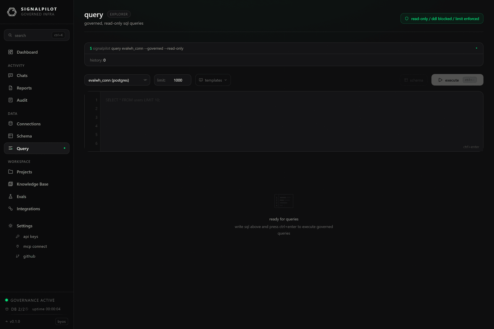

# Query console

**Query** is a governed SQL editor in the browser. It runs through exactly the
same path as the agent's `query_database` tool — parse-time DDL/DML blocking,
LIMIT injection, the dangerous-function denylist, and a full audit record — so
what you can do here is what the agent can do, and both are logged the same way.

The header says so out loud: *read-only / ddl blocked / limit enforced*.

## Running a query

1. Pick a **connection**. The console is empty until you do.
2. Write SQL, or start from a **template** — each connector ships a handful
   (table sizes, recent activity, warehouse or job history, engine settings)
   chosen for that engine, so the Snowflake templates query
   `snowflake.account_usage` while the DuckDB ones query `duckdb_settings()`.
3. Set the **row limit** — 1000 by default. A query with no `LIMIT` gets one
   injected; a query whose own limit is higher is capped.
4. Run it. Results render as a table, with the row count and elapsed time.

## Results

- **Export CSV** and **Export JSON** download the current result set, named
  `query-<timestamp>`.
- **History** keeps your recent successful queries in the browser
  (`localStorage`, 50 entries), so it is per-browser and not shared with your
  team. The server-side equivalent is the `query_history` MCP tool, which is
  per-connection and available to the agent.

## What gets blocked

Anything that writes or escapes: `INSERT`, `UPDATE`, `DELETE`, `CREATE`, `DROP`,
`ALTER`, `GRANT`, `COPY`, multi-statement bodies, and around 118 dangerous
functions across 10 dialects (`pg_read_file`, `LOAD_FILE`, `xp_cmdshell`, and
friends). Blocking happens at parse time, before the query reaches your
warehouse. See [Governance](/docs/reference/governance) for the full rules.

If you need to write, that is what a project and a branch are for — see
[Projects](/docs/product/projects).

## When to use it instead of the agent

The console is the right tool when you already know the SQL and want the result,
when you are checking what the agent saw, or when you are validating a fix before
recording it in the [knowledge base](/docs/product/knowledge-base). For anything
exploratory, the agent has better tools than you do here — `schema_link`,
`find_join_path`, `analyze_grain` — and it leaves a trail you can review.
