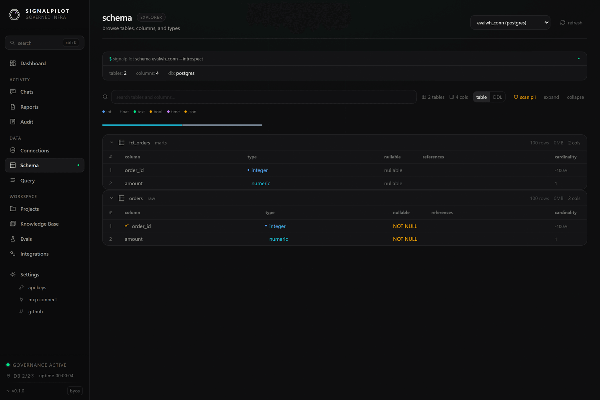

# Schema explorer

**Schema** is the human view of what the agent sees: every table in a
connection, its columns, types, nullability, keys, and comments — plus the
governance annotations layered on top.

Pick a connection, then search across tables *and* column names to find the one
you mean. Selecting a table shows:

- **Columns** — name, type, nullability, primary and foreign keys, and any
  comment carried from the warehouse.
- **Cardinality** — distinct-value counts where the connector supports them.
- **References** — outgoing foreign keys, so you can walk a join path by hand.
- **CREATE TABLE DDL** — the reconstructed DDL, copyable.

The schema is cached; re-scanning refreshes it. The same cache backs the agent's
`list_tables`, `describe_table`, and `schema_overview` tools, so what you see
here is what it sees.

## PII scan

**Scan PII** runs a name-based detector across every cached column and reports
what it thinks is sensitive, per table, with a suggested rule:

| Rule | Effect when applied |
|------|---------------------|
| `hash` | Values are replaced with a stable hash in query results |
| `hide` | Values are replaced with a redaction marker |

The scan is a *proposal*, not an enforcement — it detects, it does not change
behaviour on its own. Detection is available on every plan; enforced redaction on
query results is a paid feature (see [plan limits](/docs/setup/cloud#plan-limits)).

The scan matches on column names, so it finds `email`, `ssn`, `phone_number`, and
misses a sensitive column called `field_7`. Treat it as a first pass over a
schema you do not know, then encode the real answer in annotations.

## Annotations: blocking tables and marking columns

Per-connection annotations are the governance layer under the explorer. Two
things they control:

- **Blocked tables.** A blocked table is refused at query time — for you, for
  the agent, for everything going through the gateway. This is how you keep a
  payroll table out of reach without changing warehouse grants.
- **PII columns.** A column marked `hash` or `hide` is transformed in results,
  again for every caller.

Annotations live per connection and are cached with a TTL of
`SP_ANNOTATIONS_TTL` (60 seconds by default), so a change takes effect within a
minute without a restart.

## Related

- **[Governance](/docs/reference/governance)** — the full rule set applied to
  every query.
- **[Schema tools](/docs/reference/tools-schema)** — the MCP equivalents of this
  page, including `schema_diff` for detecting drift between scans.
- **[Connection health](/docs/product/activity#connection-health)** — latency and
  error rates per connection.
