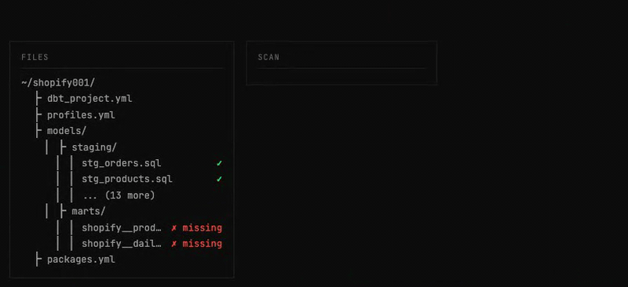
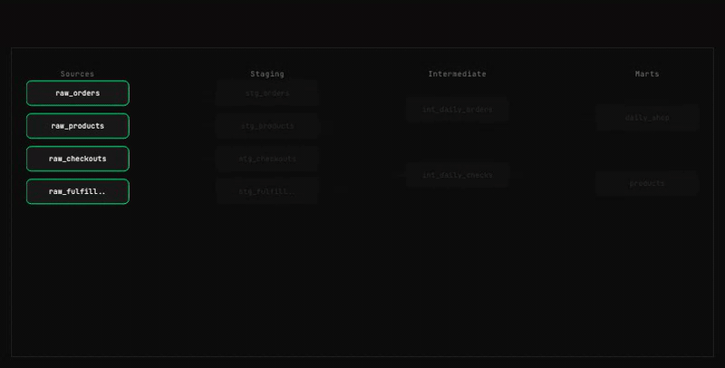

# System Overview

## Architecture diagram

```
┌─────────────────────────────────────────────────────────────┐
│  Your AI Agent (Claude Code, Agent SDK, any MCP client)     │
└────────────────────────────┬────────────────────────────────┘
                             │ MCP Protocol (streamable-http)
┌────────────────────────────▼────────────────────────────────┐
│  SignalPilot Gateway                                         │
│  ┌────────────┐ ┌──────────────┐ ┌───────────────────────┐ │
│  │ Governance │ │ Schema       │ │ dbt Project           │ │
│  │ • LIMIT    │ │ • DDL        │ │ • Map / Validate      │ │
│  │ • DDL block│ │ • Explore    │ │ • Model verification  │ │
│  │ • Audit    │ │ • Join paths │ │ • Date boundaries     │ │
│  └────────────┘ └──────────────┘ └───────────────────────┘ │
└────────────────────────────┬────────────────────────────────┘
                             │
        ┌────────────────────┼────────────────────┐
        ▼                    ▼                    ▼
   ┌─────────┐        ┌──────────┐        ┌──────────┐
   │ DuckDB  │        │ Postgres │        │Snowflake │
   └─────────┘        └──────────┘        └──────────┘
```

## In motion

| Step | What it shows |
|------|---------------|
|  | A natural-language ask flowing through Claude Code → MCP → governed query. |
|  | dbt project scan + schema discovery before a build. |
|  | dbt DAG / model lineage as the workflow expands. |
|  | Parse-time governance rejecting a DDL attempt. |
|  | Verifier-agent receipt after a successful build. |

## Components

| Component | Responsibility |
|-----------|---------------|
| **Gateway** | FastAPI backend. Exposes 32 MCP tools over `streamable-http`. Handles auth, rate limiting, SQL governance, query execution, and audit logging. Port `3300`. |
| **Web UI** | Next.js 16 frontend. Connection management, query history, latency dashboards, credential UI. Port `3200`. |
| **Engine** | SQL governance: AST parsing, DDL/DML blocking, dangerous function denial, LIMIT injection, dialect normalization. Covers 7 dialects. |
| **Connectors** | 11 database connectors with pooling and SSH tunneling. Supports DuckDB, PostgreSQL, MySQL, SQLite, SQL Server, Snowflake, Databricks, BigQuery. |
| **Auth** | Clerk JWT (cloud) or API key (local + cloud). Org-scoped with brute-force protection. |
| **Plugin** | Claude Code plugin: 9 skills + 1 verifier agent. Installed separately via `claude plugin`. |
| **sp-sandbox** | gVisor sandboxed Python execution for code that needs local filesystem access. |
| **Cloud** | [SignalPilot Cloud](https://app.signalpilot.ai) — hosted gateway with SSO, multi-tenant isolation, managed history. |

## Project structure

```
SignalPilot/
├── signalpilot/
│   ├── gateway/              # FastAPI backend — MCP server, REST API, governance
│   │   └── gateway/
│   │       ├── api/          # REST API modules
│   │       ├── connectors/   # 11 database connectors + pooling + SSH tunneling
│   │       ├── governance/   # Budget, cache, PII redaction, annotations
│   │       ├── mcp/          # 32 MCP tool definitions (modular package)
│   │       ├── engine/       # SQL validation, LIMIT injection, function denylist
│   │       ├── dbt/          # Project scanning, validation, hazard detection
│   │       ├── db/           # SQLAlchemy ORM models + async engine
│   │       └── auth.py       # Clerk JWT (cloud) / local auth + org role enforcement
│   └── web/                  # Next.js 16 frontend — 20 pages, Tailwind CSS
│       ├── app/              # App router pages (dashboard, connections, query, etc.)
│       ├── components/       # 20 UI components (sidebar, command palette, etc.)
│       └── lib/              # API client, auth context, hooks
├── plugin/                   # Claude Code plugin (9 skills, 1 verifier agent)
│   ├── agents/               # Verifier agent (7-check post-build protocol)
│   └── skills/               # dbt-workflow, sql-workflow, db-specific SQL, etc.
├── sp-sandbox/               # gVisor sandboxed Python execution
├── benchmark/                # Spider 2.0-DBT benchmark suite (SOTA: 51.56%)
└── docker-compose.yml        # Full stack: web, gateway, postgres, sandbox
```

## Deployment modes

### Self-hosted (Docker Compose)

```
docker compose up -d
# Web UI:   http://localhost:3200
# Gateway:  http://localhost:3300
```

Single `docker-compose.yml` brings up the gateway, web UI, PostgreSQL backend, and sandbox. No external services required. Auth is API-key based by default.

### SignalPilot Cloud

```
# Point Claude Code at the cloud gateway
claude mcp add --transport http signalpilot https://gateway.signalpilot.ai/mcp \
  --header "Authorization: Bearer YOUR_API_KEY"
```

Multi-tenant. Clerk JWT for SSO. Org-scoped API keys. Managed history, dashboards, and encrypted credential storage. See [Cloud setup](/docs/setup/cloud).

## MCP transport

SignalPilot uses **streamable-http** — the modern MCP standard (supersedes SSE). The endpoint is mounted at:

- `/mcp` (canonical)
- `/` (backward compatibility)

The protocol is stateless per request. Claude Code maintains session context; the gateway is stateless between calls.
