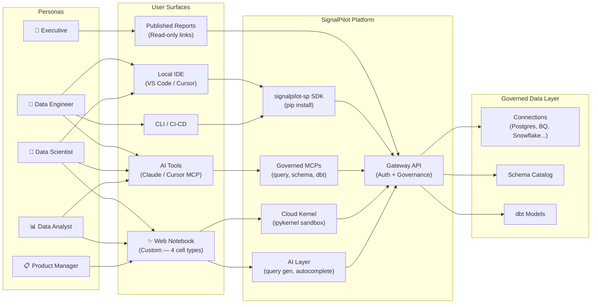
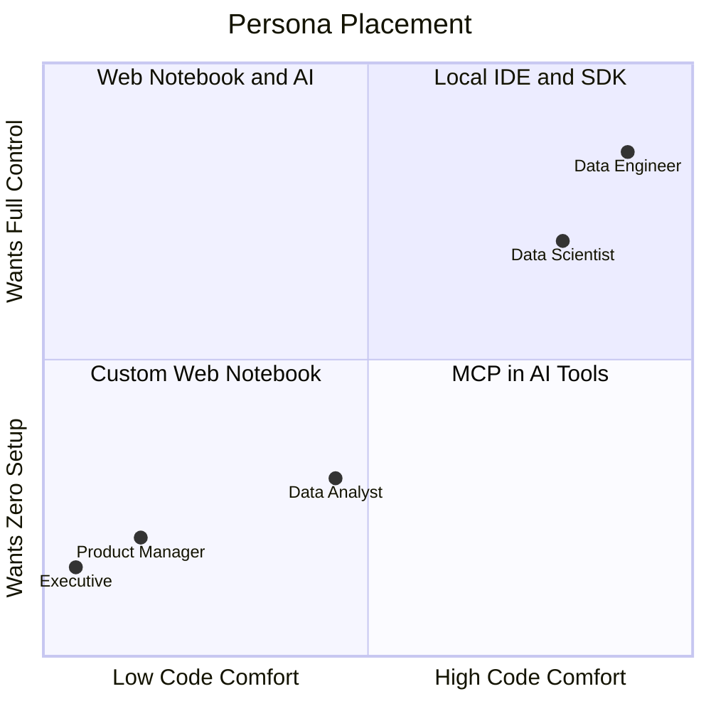
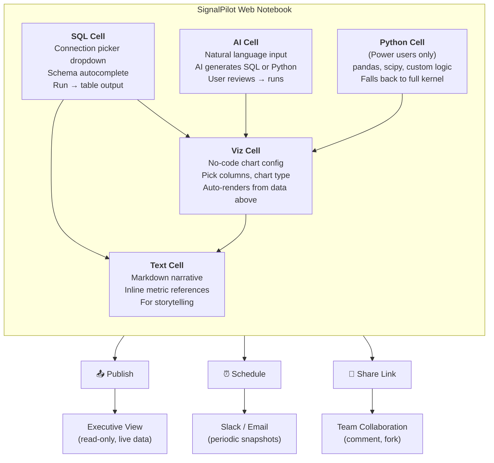
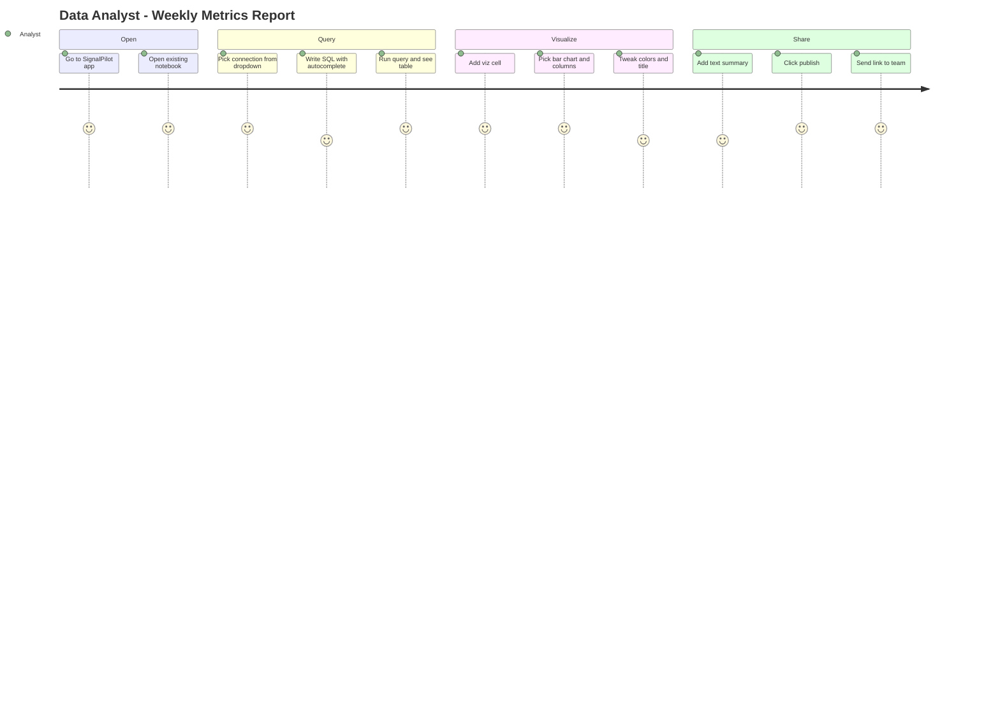
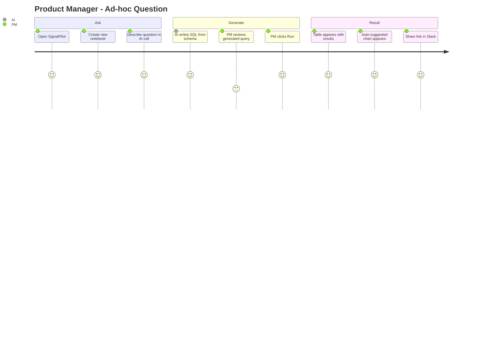
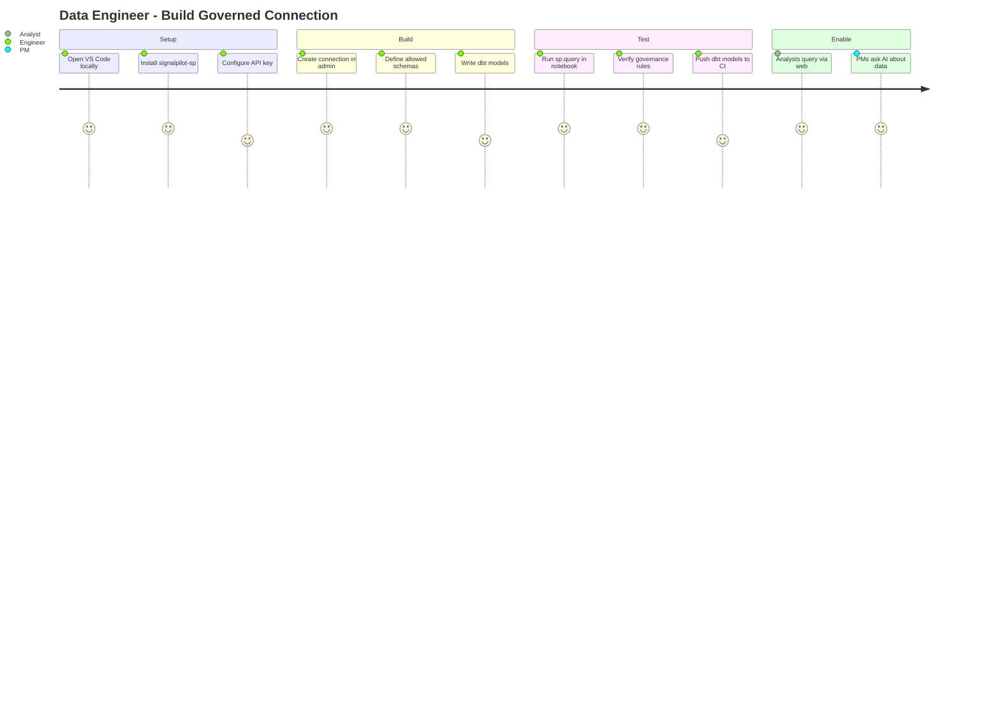
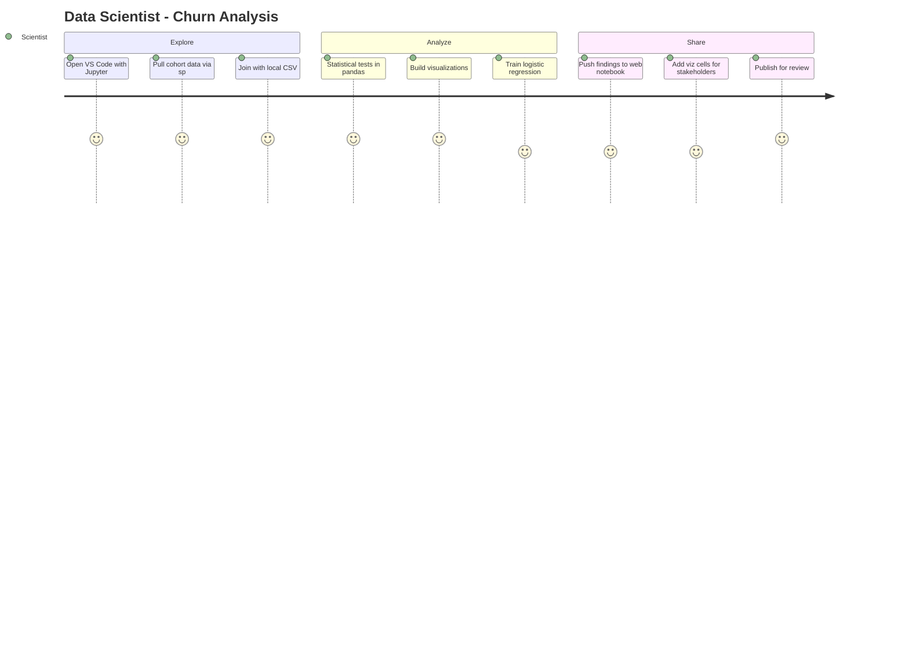
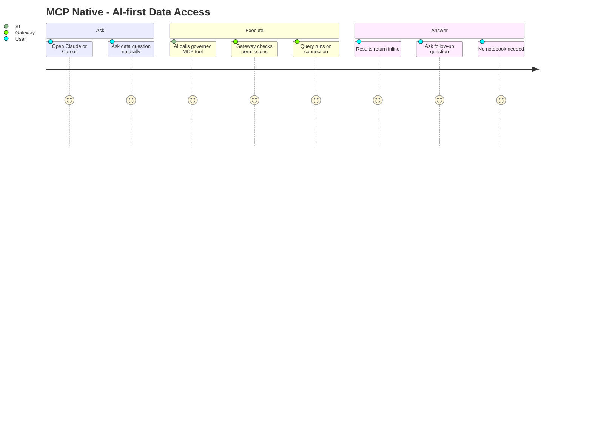
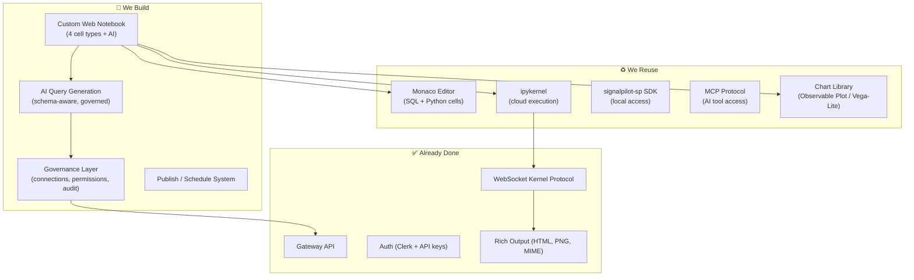

# SignalPilot — ICP Workflows & Surface Map

Five personas, five different relationships with data. The core insight: **technical users don't need our notebook** — they need governed data access inside *their* tools. The custom web notebook exists for non-technical users who need zero-setup, AI-assisted data exploration.

---

## 1. Persona → Surface → Platform

Every persona reaches SignalPilot's governed data layer, but through different surfaces. The Gateway API is the single chokepoint — every query, every tool, every notebook cell passes through it. This is where auth, permissions, and audit happen. No surface bypasses governance.

- **Engineers and Scientists** use their own tools (VS Code, Cursor, CLI). They install the `signalpilot-sp` SDK or connect via MCP. They don't need our UI.
- **Analysts** live in the web notebook. They write SQL against governed connections with schema autocomplete. The cloud kernel runs their code.
- **PMs** also use the web notebook, but lean on the AI cell — describe what they want, AI generates the query.
- **Executives** never touch a notebook. They consume published reports — read-only, live-updating links.

## 2. Code Comfort vs. SignalPilot Surface

Two axes define which surface each persona gravitates toward:

- **Code comfort** (x-axis): Can they write SQL? Python? Or do they need natural language?
- **Setup tolerance** (y-axis): Will they install packages and configure environments, or do they expect it to "just work" in a browser?

The quadrants map directly to product decisions:
- **Top-right** (high code, full control): Engineers and scientists. Serve them with the SDK and MCP — don't force them into our UI.
- **Bottom-left** (low code, zero setup): PMs and executives. This is where the custom web notebook with AI assistance matters most. If we nail this quadrant, we unlock a market that traditional BI tools serve poorly.
- **Middle**: Analysts straddle the line. They can write SQL but don't want environment management. The web notebook with governed connections and schema autocomplete is their sweet spot.

## 3. The Custom Web Notebook — Cell Types

This is NOT a Jupyter clone. It's a purpose-built notebook with 5 cell types designed for analysts and PMs who need to explore governed data without managing Python environments.

**SQL Cell** — The workhorse. A connection picker dropdown (only shows connections the user has access to), schema-aware autocomplete, and a run button. Output is always a table. This is what analysts use 80% of the time.

**AI Cell** — The unlock for non-technical users. Type a question in English ("show me weekly signups by plan for the last quarter"), the AI generates SQL or Python using the schema catalog, the user reviews and runs. This is what makes SignalPilot accessible to PMs.

**Viz Cell** — No-code charting. Takes the output from a SQL or AI cell above, lets the user pick chart type, columns, colors. Think "Google Sheets chart wizard" not "matplotlib." Powered by a client-side chart library (Observable Plot or Vega-Lite).

**Text Cell** — Markdown for narrative. Analysts use this to annotate their findings, add context, tell the story around the data. Can reference metrics from cells above.

**Python Cell** — Escape hatch for power users. Full pandas/scipy/custom logic via the cloud kernel. Most analysts never touch this; data scientists use it when they need something SQL can't do.

The flow between cells is top-down: SQL/AI cells produce data, Viz cells render it, Text cells narrate it. The notebook then publishes, schedules, or shares — reaching executives who never open a notebook themselves.

## 4. Workflow Journeys

Five concrete workflows — one per persona. Each shows the end-to-end journey from intent to outcome. The satisfaction scores (1-5) flag where friction exists today.

### Data Analyst — Weekly Metrics Report

The bread-and-butter use case. An analyst who already knows what they want to measure opens their existing notebook, runs governed SQL, adds a chart, publishes for the team. Zero environment setup. The connection picker and schema autocomplete are the key UX — they should never have to ask an engineer "what's the table name?"

### Product Manager — Ad-hoc Question

The highest-value, hardest-to-nail workflow. A PM has a business question ("how many users signed up last week by plan?") but can't write the SQL. They describe it in an AI cell, the AI generates a query using the schema catalog, and the PM reviews it. The trust gap at the "reviews generated query" step (scored 3) is the critical UX challenge — the PM can't verify the SQL is correct. Solutions: show a plain-English summary of what the query does, show row count expectations, let them compare against known benchmarks.

### Data Engineer — Build Governed Connection

The engineer is the enabler. They don't consume data through SignalPilot's web notebook — they *build the governed layer* that everyone else consumes. Their workflow happens in their own IDE with the sp SDK. The payoff is in the "Enable" section: once they've set up a governed connection and dbt models, every analyst and PM in the org can instantly query that data through the web notebook or MCP. The engineer's work multiplies across the whole team.

### Data Scientist — Churn Analysis

Scientists need the most flexibility. They pull governed data via sp SDK, but then join it with local files (CSVs, survey exports), run statistical models, and iterate fast. This workflow is deliberately local — the cloud kernel adds latency and can't access local files. The scientist only touches the web notebook at the end, to publish findings for non-technical stakeholders. SignalPilot's value here is governed data access + a publishing layer, not the notebook itself.

### MCP Native — AI-first Data Access

The emerging workflow that bypasses notebooks entirely. A user opens Claude or Cursor, asks a data question, and the AI calls SignalPilot's governed MCP tools behind the scenes. The gateway checks permissions, runs the query, and results come back inline in the conversation. No notebook, no setup, no SQL. This is arguably the lowest-friction surface SignalPilot offers and it's already built. Every persona can use this — from engineers debugging in Cursor to PMs asking Claude a question.

## 5. What We Build vs. What Exists

The build/reuse/done split shows why this is feasible with a small team.

**Already done** — The Gateway API, auth (Clerk + API keys), the WebSocket kernel protocol, and rich output (HTML tables, PNG charts, full MIME bundles) are shipped. This is the hard infrastructure layer.

**Reuse from OSS** — Monaco editor (same editor engine as VS Code) for SQL and Python cells. ipykernel for cloud code execution. MCP protocol for AI tool access. A chart library (Observable Plot or Vega-Lite) for no-code visualizations. The sp SDK for local data access.

**We build** — Four things: (1) the custom web notebook with its 5 cell types, (2) the governance UX layer (connection picker, schema browser, permission management), (3) AI query generation that's schema-aware and respects governance rules, (4) publish/schedule system so notebooks become living reports.

The custom notebook is the biggest build, but it's a frontend on top of infrastructure that already exists. The kernel protocol, rich output, auth — all done. We're building the UI shell, not the engine.

